# Memory Layout

## Overview

The memory map aims to allocate the top canonical addresses specifically for usage.
The kernel itself is loaded at 0xFFFFFF8000000000.

In order to allow for easier page table management, the entire physical address space (up to 512GB) is mapped to 0xFFFFFF0000000000.

## Allocation at PLM4 Level

Each index into the PLM4 table references a 512GB block of memory, which is further layed out as follows:

<table>
  <thead>
    <tr>
      <th align="center">PLM Index</th>
      <th align="center">PLM Address Range</th>
      <th align="center">OS Item</th>
      <th align="center">Range</th>
      <th align="center">Notes</th>
    </tr>
  </thead>
  <tbody>
    <tr>
      <td align="center" rowspan="9">511</td>
      <td align="center" rowspan="9"><tt>0xFFFFFFFFFFFFFFFF</tt> <tt>0xFFFFFF8000000000</tt></td>
      <td align="center">Task State Data</td>
      <td align="center"><tt>0xFFFFFFF010000000</tt></td>
      <td>Task Stacks/Metadata <a href="#per-task-state">More details</a></td>
    </tr>
    <tr>
      <td align="center">CPU Stacks/Metadata (Expanding Up)</td>
      <td align="center"><tt>0xFFFFFFF000000000</tt></td>
      <td>1MB alloction per CPU (up to 256 CPUs) <a href="#per-cpu-state">More details</a> </td>
    </tr>
    <tr>
      <td align="center">512GB Page Aggregator</td>
      <td align="center"><tt>0xFFFFFFE000203000</tt> <tt>0xFFFFFFE000202000</tt></td>
      <td>512GB pages calculated for parity, but not used</td>
    </tr>
    <tr>
      <td align="center">1GB Page Stack</td>
      <td align="center"><tt>0xFFFFFFE000202000</tt> <tt>0xFFFFFFE000201000</tt></td>
      <td></td>
    </tr>
    <tr>
      <td align="center">1GB Page Aggregator</td>
      <td align="center"><tt>0xFFFFFFE000201000</tt> <tt>0xFFFFFFE000200000</tt></td>
      <td></td>
    </tr>
    <tr>
      <td align="center">2MB Page Stack</td>
      <td align="center"><tt>0xFFFFFFE000200000</tt> <tt>0xFFFFFFE000000000</tt></td>
      <td></td>
    </tr>
    <tr>
      <td align="center">2MB Page Aggregator</td>
      <td align="center"><tt>0xFFFFFFD040100000</tt> <tt>0xFFFFFFD040000000</tt></td>
      <td></td>
    </tr>
    <tr>
      <td align="center">4KB Page Stack</td>
      <td align="center"><tt>0xFFFFFFD040000000</tt> <tt>0xFFFFFFD000000000</tt></td>
      <td></td>
    </tr>
    <tr>
      <td align="center">Kernel</td>
      <td align="center"><tt>0xFFFFFF800053C000</tt> <tt>0xFFFFFF8000000000</tt></td>
      <td>~5MB (should be updated regularly)</td>
    </tr>
    <tr>
      <td align="center">510</td>
      <td align="center"><tt>0xFFFFFF7FFFFFFFFF</tt> <tt>0xFFFFFF0000000000</tt></td>
      <td align="center">Physical Mirror</td>
      <td align="center">*</td>
      <td>Up to 512GB of physical memory "offset identity mapped" here.</td>
    </tr>
  </tbody>
</table>

## Per Cpu State

As shown above, starting at `0xFFFFFFF000000000` there is a 1MB block per each active CPU core.
This block contains the core's stack, it's GDT and TSS, and an object (CpuState) containing essential configuration 
and structures (such as the scheduler).
Additionally, each of the exception stack's contained in the TSS are allocated in this 1MB block.

| Item             | Number Of Pages |
| ---------------- | --------------- |
| Stack            | 238             |
| Exception Stacks | 4 * 4 = 16      |
| GDT + TSS        | 1               |
| CpuState         | 1               |

The main core stack, which supports running the core initialiation and then the scheduler, exists at the top 
of the 1MB block and expands downward.
Each of the 4 exceptions stacks (double fault, NMI, debug and MCE) come next at 16kb each.
The GDT is at the base of the next page, with the TSS included directly above it within the same page.
The base of the 1MB page contains the CpuState structure.

Exception stacks == 4*4 = 16kb each, * 4 stacks == 64kb

Allocate the GDT out of this block as well?
- How big is it?  null, data and code descriptor + tss descriptor = 60 bytes

Also the TSS
-104 bytes

## Per Task State

In order to represent tasks by a simple ID, an array is allocated (paged in on demand) containing the 
task stack and meta data.

## Graph 

Not sure if this conveys anything new?
Is there anything that can be done here to visualize the memory better?
Colour coding is one thing (although it's all kernel memory...)

```mermaid
graph TD
    %% Global Text Override for Dark/Light Themes
    %%{init: { 'theme': 'base', 'themeVariables': { 'textColor': '#000000' }}}%%

    %% Styling rules for continuous block look
    classDef boundary fill:#f1f2f6,stroke:#2f3640,stroke-width:2px,color:#000000;
    classDef kernel fill:#ffeaa7,stroke:#2f3640,stroke-width:2px,color:#000000;
    classDef hole fill:#dfe4ea,stroke:#2f3640,stroke-width:2px,stroke-dasharray: 5 5,color:#000000;
    classDef user fill:#74b9ff,stroke:#2f3640,stroke-width:2px,color:#000000;
    classDef note fill:#a29bfe,stroke:#2f3640,stroke-width:1px,stroke-dasharray: 3 3,color:#000000;

 
    %% Kernel memory regions
    LimitHigh["<b>0xFFFFFFFFFFFFFFFF</b>
    Virtual Address Space Limit"]:::boundary
    
    Kernel["
    <tt>0xFFFFFFFFFFFFFFFF</tt>
    <b>KERNEL IMAGE</b>
    <tt>FFFFFF8000000000</tt>"]:::kernel


    Stack["
    <tt>0xFFFFFF8000000000</tt>
    KERNEL STACK
    Down Arrow (2mB)"]:::hole
    
    Mirror["
    <tt>0xFFFFFF7FFFFFFFFF</tt>
    <b>PHYSICAL MIRROR</b>
    <tt>0xFFFFFF0000000000</tt>"]:::hole



    Mgmt4kb["
    <b>4KB page management</b>
    <tt>0xFFFFFFE000000000</tt>
    4KB page stack
    <tt>0xFFFFFFD040000000</tt>
    2MB page aggregator
    <tt>0xFFFFFFD000000000</tt>"]:::hole

    Mgmt2mb["
    <b>2MB page management</b>
    <tt>0xFFFFFFE000201000</tt>
    2MB page stack
    <tt>0xFFFFFFE000200000</tt>
    1GB page aggregator
    <tt>0xFFFFFFE000000000</tt>"]:::hole

    Mgmt1gb["
    <b>1GB page management</b>
    <tt>0xFFFFFFE000203000</tt>
    1GB page stack
    <tt>0xFFFFFFE000202000</tt>
    512GB page aggregator
    <tt>0xFFFFFFE000201000</tt>"]:::hole

    LimitLow["
    <tt>0x0000000000000000</tt>
    Base/Null"]:::boundary

    %% Hidden Link Layer to lock nodes together continuously into a unified rectangle

    LimitHigh === Kernel === Stack === Mirror === Mgmt1gb === Mgmt2mb === Mgmt4kb === LimitLow

    %% Layout Tuning
    %% linkStyle 0,1,2,3,4,5,6,7,8,9,10 stroke:#2f3640,stroke-width:4px;
```

