# Memory Layout

## Overview

The memory map aims to allocate the top canonical addresses specifically 
for usage.
The kernel itself is loaded at 0xFFFFFF8000000000.

In order to allow for easier page table management, the entire physical address space (up to 512GB) is mapped to 0xFFFFFF0000000000.

## Allocation at PLM4 Level

Each index into the PLM4 table references a 512GB block of memory.

<table>
  <thead>
    <tr>
      <th style="text-align: center;">PLM Index</th>
      <th style="text-align: center;">PLM Address Range</th>
      <th style="text-align: center;">OS Item</th>
      <th style="text-align: center;">Range</th>
      <th style="text-align: center;">Notes</th>
    </tr>
  </thead>
  <tbody>
    <tr>
      <td style="text-align: center;" rowspan="8">511</td>
      <td style="text-align: center;" rowspan="8"><tt>0xFFFFFFFFFFFFFFFF</tt> <tt>0xFFFFFF8000000000</tt></td>
      <td style="text-align: center;">CPU Stacks/Metadata</td>
      <td style="text-align: center;"><tt>0xFFFFFFFFFFFFFFFF</tt> <tt>...</tt></td>
      <td>1MB stack + 1MB Meta per CPU core</td>
    </tr>
    <tr>
      <td style="text-align: center;">512GB Page Aggregator</td>
      <td style="text-align: center;"><tt>0xFFFFFFE000203000</tt> <tt>0xFFFFFFE000202000</tt></td>
      <td>512GB pages calculated for parity, but not used</td>
    </tr>
    <tr>
      <td style="text-align: center;">1GB Page Stack</td>
      <td style="text-align: center;"><tt>0xFFFFFFE000202000</tt> <tt>0xFFFFFFE000201000</tt></td>
      <td></td>
    </tr>
    <tr>
      <td style="text-align: center;">1GB Page Aggregator</td>
      <td style="text-align: center;"><tt>0xFFFFFFE000201000</tt> <tt>0xFFFFFFE000200000</tt></td>
      <td></td>
    </tr>
    <tr>
      <td style="text-align: center;">2MB Page Stack</td>
      <td style="text-align: center;"><tt>0xFFFFFFE000200000</tt> <tt>0xFFFFFFE000000000</tt></td>
      <td></td>
    </tr>
    <tr>
      <td style="text-align: center;">2MB Page Aggregator</td>
      <td style="text-align: center;"><tt>0xFFFFFFD040100000</tt> <tt>0xFFFFFFD040000000</tt></td>
      <td></td>
    </tr>
    <tr>
      <td style="text-align: center;">4KB Page Stack</td>
      <td style="text-align: center;"><tt>0xFFFFFFD040000000</tt> <tt>0xFFFFFFD000000000</tt></td>
      <td></td>
    </tr>
    <tr>
      <td style="text-align: center;">Kernel</td>
      <td style="text-align: center;"><tt>0xFFFFFF800053C000</tt> <tt>0xFFFFFF8000000000</tt></td>
      <td>~5MB (should be updated regularly)</td>
    </tr>
    <tr>
      <td style="text-align: center;">510</td>
      <td style="text-align: center;"><tt>0xFFFFFF7FFFFFFFFF</tt> <tt>0xFFFFFF0000000000</tt></td>
      <td style="text-align: center;">Physical Mirror</td>
      <td align="center" style="text-align: center;">*</td>
      <td>Kernel Stack also expands down from top, which overlaps mirror.  This needs to be fixed.</td>
    </tr>
  </tbody>
</table>

## Graph 

Not sure if this conveys anything new?
Is there anything that can be done here to visualize the memory better?
Colour coding is one thing (although it's all kernel memory...)

```mermaid
graph TD
    %% Global Text Override for Dark/Light Themes
    %%{init: { 'theme': 'base', 'themeVariables': { 'textColor': '#000000' }}}%%

    %% Styling rules for continuous block look
    classDef boundary fill:#f1f2f6,stroke:#2f3640,stroke-width:2px,color:#000000;
    classDef kernel fill:#ffeaa7,stroke:#2f3640,stroke-width:2px,color:#000000;
    classDef hole fill:#dfe4ea,stroke:#2f3640,stroke-width:2px,stroke-dasharray: 5 5,color:#000000;
    classDef user fill:#74b9ff,stroke:#2f3640,stroke-width:2px,color:#000000;
    classDef note fill:#a29bfe,stroke:#2f3640,stroke-width:1px,stroke-dasharray: 3 3,color:#000000;

 
    %% Kernel memory regions
    LimitHigh["<b>0xFFFFFFFFFFFFFFFF</b>
    Virtual Address Space Limit"]:::boundary
    
    Kernel["
    <tt>0xFFFFFFFFFFFFFFFF</tt>
    <b>KERNEL IMAGE</b>
    <tt>FFFFFF8000000000</tt>"]:::kernel


    Stack["
    <tt>0xFFFFFF8000000000</tt>
    KERNEL STACK
    Down Arrow (2mB)"]:::hole
    
    Mirror["
    <tt>0xFFFFFF7FFFFFFFFF</tt>
    <b>PHYSICAL MIRROR</b>
    <tt>0xFFFFFF0000000000</tt>"]:::hole



    Mgmt4kb["
    <b>4KB page management</b>
    <tt>0xFFFFFFE000000000</tt>
    4KB page stack
    <tt>0xFFFFFFD040000000</tt>
    2MB page aggregator
    <tt>0xFFFFFFD000000000</tt>"]:::hole

    Mgmt2mb["
    <b>2MB page management</b>
    <tt>0xFFFFFFE000201000</tt>
    2MB page stack
    <tt>0xFFFFFFE000200000</tt>
    1GB page aggregator
    <tt>0xFFFFFFE000000000</tt>"]:::hole

    Mgmt1gb["
    <b>1GB page management</b>
    <tt>0xFFFFFFE000203000</tt>
    1GB page stack
    <tt>0xFFFFFFE000202000</tt>
    512GB page aggregator
    <tt>0xFFFFFFE000201000</tt>"]:::hole

    LimitLow["
    <tt>0x0000000000000000</tt>
    Base/Null"]:::boundary

    %% Hidden Link Layer to lock nodes together continuously into a unified rectangle

    LimitHigh === Kernel === Stack === Mirror === Mgmt1gb === Mgmt2mb === Mgmt4kb === LimitLow

    %% Layout Tuning
    %% linkStyle 0,1,2,3,4,5,6,7,8,9,10 stroke:#2f3640,stroke-width:4px;
```

